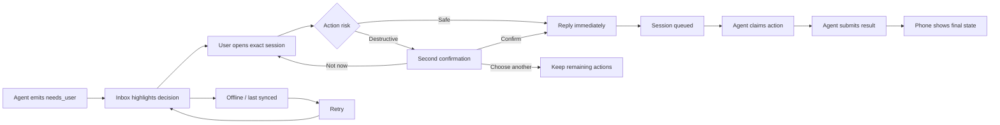

# Knock Knock — Production Product Core

## Product goal

Knock Knock is a decision inbox for coding agents. An agent creates a durable
session, asks for a human decision only when it is blocked, and receives the
answer back on that exact session. The iPhone is the trusted decision surface;
it is not a general-purpose assistant or chat replacement.

## Core capability map

| Capability | User value | Current foundation | Production completion |
|---|---|---|---|
| Identity and pairing | Connect an iPhone to one or more trusted agents without sharing a password | JWT user auth, one-time pairing code, scoped agent key | QR/deep-link pairing, agent revoke/rotate, clear trust state |
| Decision inbox | See what needs attention first | Needs me / Active / All filters, search, session list | Priority, risk, age, agent identity, unread/read state, stable empty/offline states |
| Decision detail | Understand the request before choosing | Summary, progress, actions, exact routing metadata | Context sections, impact/risk explanation, expiry countdown, action result history |
| Safety gate | Prevent an accidental destructive action | Destructive action requires a second confirmation; expiry and cancellation | Explicit risk copy, deny/cancel path, audit receipt, policy-driven action classes |
| Exact session continuity | Keep a phone answer attached to the requesting agent | `session_id`, idempotency, claim/result retry safety | Resume across restarts, stale-session explanation, per-agent conversation context |
| Attention and notifications | Reach the user without requiring the app to be open | APNs, in-app knock overlay, dev inbox, deep-link opening | Notification categories/actions, background reliability, quiet hours, delivery diagnostics |
| Connection resilience | Keep decisions usable during imperfect networks | LAN API, polling, last data, retry state | Hosted HTTPS, exponential retry, offline queue/read cache, health diagnostics |
| Agent interoperability | Use the same decision contract from different hosts | MCP server + CLI, Codex config, Cursor rule, Paperclip governed stdio boundary | One-command install, host-specific smoke tests, versioned Skill contract |
| Trust and operations | Know who asked and what happened | Agent/skill/chat routing, API logs, audit-safe result behavior | User-facing event history, key rotation, privacy controls, telemetry without secrets |

## Production information architecture

### 1. Welcome / secure pairing

Explain the product in one sentence, show the security promise, and offer:

- Connect an agent (QR/deep link or one-time code)
- Enter a pairing code
- Recovery path for an unavailable bridge

### 2. Inbox

The default signed-in screen. It should answer “what needs me right now?” in
under two seconds:

- Orange attention summary when decisions are waiting
- Needs me / Active / All filters
- Search by agent, skill, task, or session
- Cards showing agent, task, risk, age, and current state
- Clear offline/last-synced state

### 3. Decision detail

The decision screen is the product's most important surface:

- Agent and skill identity
- Exact task summary and relevant facts
- Impact/risk/expiry information
- Explicit action buttons
- Destructive confirmation sheet with plain-language consequence
- Result state showing queued, claimed, completed, cancelled, or expired
- “Returned to this exact agent session” trust cue

### 4. Settings / trusted connections

Settings should be operational, not a debug dump:

- Connection health and last successful sync
- Trusted agents with revoke/rotate controls
- Generate pairing code
- Notifications and APNs status
- Advanced diagnostics behind a disclosure
- Build/about/sign-out

### 5. Activity and recovery states

These are cross-cutting states, not separate chat:

- Loading and first-run empty state
- Bridge unreachable with last-known data
- Expired decision with explanation and retry guidance
- Cancelled decision with audit receipt
- Notification permission denied
- Session no longer available

## Interaction state contract

The phone is a decision surface with explicit state transitions. It never
silently turns a user tap into a generic chat message.

| UI state | User can do | Contract evidence |
|---|---|---|
| Loading | Wait for the first sync | Refresh indicator; no fabricated decision |
| Needs your decision | Open the exact session and choose an action | Session id, agent id, skill, risk, facts, expiry |
| Awaiting confirmation | Confirm, choose another action, or leave it for later | Action id and second-confirmation gate |
| Queued / claimed | Return to Inbox or watch progress | Same `session_id`; action is claimable only after reply |
| Succeeded / failed / cancelled / expired | Read the outcome and routing receipt | Terminal state and exact-session explanation |
| Offline | Read last-known data or retry | Offline pill, last sync time, retry action |
| Pairing | Generate, copy, and claim one-time code from an agent host | Pairing code expiry and agent-bound credential flow |

The implemented screens use this contract directly: `ProductionInboxView`,
`ProductionDecisionDetailView`, `ProductionSettingsView`, and
`ProductionKnockOverlay` are the four user-facing surfaces; API/MCP tests verify
the transition semantics underneath them.

## UI/UX reference

[Production wireframe v2 — warm, clear, friendly](design/knock-knock-production-wireframe-v2.png)

The board is a high-level composition reference, not a pixel-perfect asset. The
implementation should preserve its hierarchy: restrained orange only for
attention/risk, neutral surfaces for ordinary work, and no generic chat bubbles.

## Implementation order

1. Establish a shared SwiftUI visual system: colors, spacing, cards, status pills,
   risk labels, accessibility identifiers, and dynamic type behavior.
2. Refactor the signed-in shell around Inbox and Settings while keeping the
   existing API/session contract unchanged.
3. Upgrade the decision detail into a dedicated decision card plus confirmation
   sheet, preserving the current destructive safety behavior.
4. Make pairing a first-class onboarding/settings flow and hide development-only
   push diagnostics behind Advanced.
5. Add production state fixtures and UI tests for loading, empty, waiting,
   awaiting-confirmation, completed, expired, and offline states.
6. Validate on the real iPhone 13 Pro and Simulator, then package the hosted API
   and TestFlight onboarding as the next release track.

## Next-phase definition of done

- A new user can understand the product and reach pairing without seeing debug
  terminology.
- The Inbox makes the highest-priority decision visually dominant.
- A user can identify the requesting agent, risk, impact, and expiry before acting.
- Every action visibly communicates whether it is reversible and whether a second
  confirmation is required.
- A reply, retry, cancellation, or expiry remains bound to the exact session.
- The iPhone 13 Pro build and iOS 15 compatibility build both compile and pass the
  existing API/MCP regressions.
- The wireframe reference and implemented screens are documented together.
